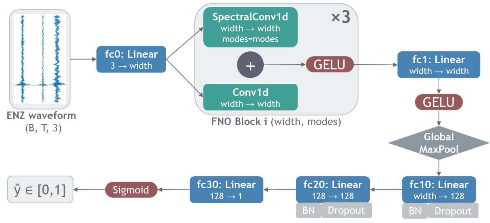

# FNOclass


Seismic event classification with a lightweight Fourier Neural Operator model (FNO).

## Overview

This repository contains the implementation of a lightweight deep learning model for seismic event classification based on the Fourier Neural Operator (FNO). The method is designed for efficient and accurate classification of seismic waveforms, particularly in resource-constrained and real-time monitoring environments.

The model achieves competitive performance with significantly fewer parameters compared to conventional deep learning architectures, making it suitable for deployment in microseismic monitoring workflows.

## Related Publication

**Ayrat Abdullin, Umair Bin Waheed, Leo Eisner, Abdullatif Al-Shuhail**  
*Seismic event classification with a lightweight Fourier Neural Operator model*  
Geophysical Prospecting (EAGE)

[Link to paper (to be added)]

If you use this repository, please cite the paper.

## Key Features

* Lightweight architecture (~34k parameters)
* High classification accuracy (F1 ≈ 0.95-0.98 depending on dataset)
* Efficient training and inference
* Suitable for real-time and edge deployment
* Robust performance under limited training data

## Method Summary

The model uses Fourier Neural Operator layers to process seismic waveforms in the frequency domain. Unlike standard CNNs, which rely on local convolutions, FNO performs global spectral convolutions, enabling efficient capture of long-range temporal dependencies.



**Figure:** Overview of the proposed Fourier Neural Operator (FNO) architecture for three-component seismic waveform classification. The input waveform is projected into a higher-dimensional feature space, processed by stacked 1-D FNO blocks, and mapped to a binary probability indicating seismic signal presence.

Input:

* 3-component waveform (E, N, Z)
* Fixed-length time window (e.g., 60 seconds)

Output:

* Probability of seismic event presence (binary classification)

## Repository Structure

```text
FNOclass/
|-- fno_class_main.ipynb   # Main notebook for preprocessing, training, evaluation, and inference
|-- utils.py               # Helper functions for data processing and labeling
|-- environment.cpu.yml    # Recommended CPU environment
|-- environment.gpu.yml    # Recommended GPU environment
|-- docs/                  # Figures and documentation assets
|-- data/                  # Directory for the datasets (e.g., STEAD merged.hdf5)
|-- sample_data/           # Lightweight pre-processed sample data for quick testing
|-- models/                # Directory where best model checkpoints are saved during training
|-- README.md
|-- LICENSE
```

## Installation

Clone the repository:

```bash
git clone https://github.com/ayratabd/FNOclass.git
cd FNOclass
```

Create one of the recommended conda environments, for CPU-only execution:

```bash
conda env create -f environment.cpu.yml
conda activate fno_class_cpu
```

or, for NVIDIA GPU acceleration:

```bash
conda env create -f environment.gpu.yml
conda activate fno_class_gpu
```

The recommended setup files are:

* `environment.cpu.yml` for CPU-only execution (tested on Windows or Linux)
* `environment.gpu.yml` for NVIDIA GPU execution (tested on Windows or Linux)

Both files use Conda for the base scientific Python stack and install the official PyTorch 2.7.1 wheel via `pip`.
The GPU environment requires an NVIDIA GPU and a compatible NVIDIA driver on the host system.

This approach ensures a consistent and reproducible development environment (Python 3.12, PyTorch 2.7.1) for both CPU and GPU users.

## Usage

Open the main notebook:

```bash
jupyter notebook fno_class_main.ipynb
```

Make sure Jupyter is running from the activated environment, or explicitly select the matching kernel in your IDE or notebook interface:

* `fno_class_cpu` for the CPU environment
* `fno_class_gpu` for the GPU environment

**Quick Start**: The notebook is configured to run out-of-the-box using a lightweight sample dataset (`sample_data/stead_sample100.pt`). This allows you to verify the environment and run the pipeline end-to-end in seconds.

To train the model on the full datasets and reproduce the paper's metrics, simply change the `USE_SAMPLE_DATA = False` toggle in the notebook and ensure the full STEAD dataset is placed in the `./data/` directory.

The notebook contains the full workflow, including:

* data loading and preprocessing
* model definition
* training with dynamic early stopping and checkpointing
* validation and testing
* inference on waveform windows
* figure generation and result inspection

## Data

### Public Dataset

This work uses the **STEAD dataset**, a large-scale global dataset of seismic waveforms.

To train the model on the full dataset and reproduce the metrics:
1. Download the required file from this [Google Drive link](https://drive.google.com/file/d/1oiuS7ByCyE2-7rARs6jXWN34Amf-Vrbg/view).
2. Place `merged.hdf5` file directly into the `./data/` directory.

### Microseismic Dataset

The field microseismic dataset used in the study is **not publicly available** due to licensing restrictions but may be obtained from the data provider upon request.

## Results

| Dataset      | F1 Score |
| ------------ | -------- |
| STEAD        | ~0.95    |
| Microseismic | ~0.98    |

The model demonstrates strong generalization and maintains high performance even with limited training data.

## Reproducibility

* Training details and hyperparameters are provided in the paper
* Random seeds are fixed (`torch.manual_seed(0)`, `np.random.seed(0)`) within the notebook for deterministic results.
* Model checkpoints tracking the best validation loss are automatically saved to `./models/`.

## Citation

```bibtex
@article{abdullin2026fno,
  title={Seismic event classification with a lightweight Fourier Neural Operator model},
  author={Abdullin, Ayrat and Waheed, Umair Bin and Eisner, Leo and Al-Shuhail, Abdullatif},
  journal={Geophysical Prospecting},
  year={2026}
}
```

## License

This repository is licensed under the MIT License.

## Notes on Paper Usage

The published journal article is subject to copyright by the publisher. Please refer to the official publication for the final version. Do not redistribute the publisher PDF unless permitted.

## Contact

For questions, suggestions, or collaboration inquiries:

**Ayrat Abdullin**<br>
Department of Geosciences<br>
King Fahd University of Petroleum and Minerals<br>
Dhahran, Saudi Arabia<br>
Email: [g202203180@kfupm.edu.sa](mailto:g202203180@kfupm.edu.sa)

---

## Acknowledgements

* STEAD dataset
* SeisBench
* Open-source ML ecosystem (PyTorch, NumPy, etc.)
